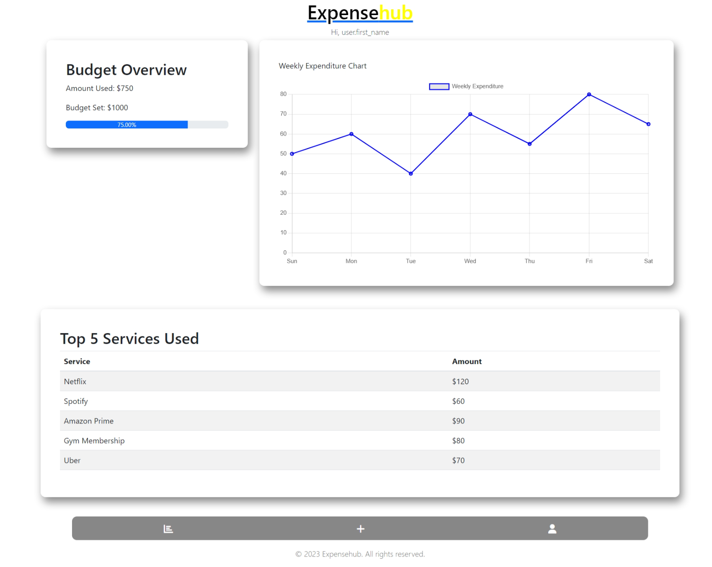

# Expense Tracker Web App

## Introduction

The Expense Tracker Web App is a web-based application built with Django and Django Rest Framework (DRF) that allows users to manage their expenses, track income, and categorize their spending. This README provides an overview of the project, instructions for installation and usage, and other essential information.

- **Demo**:[Expense Tracker Web App Demo]()
- **Author**: Peter Kanini
- **Final Project Blog Article**: [Read the Blog Article](example.com)

Have you ever wondered where your hard-earned money goes each month? Do you want a simple yet powerful tool to track your expenses, manage your finances, and stay on top of your budget? If so, welcome to the Expense Tracker Web App!


*Screenshot of the Web App*

This project was born out of a personal need. Like many of you, I found myself struggling to keep track of my expenses and income, leading to financial stress and uncertainty. I envisioned a solution that would empower users to take control of their finances and make informed decisions about their money.

## Inspiration and Challenge


My inspiration for creating the Expense Tracker Web App came from a desire to simplify financial management for everyone. I set out to build a user-friendly, yet feature-rich application that provides users with a comprehensive view of their financial health. It was a journey marked by both excitement and challenges.

### Technical Challenge

One of the technical challenges I faced was designing a robust data model to handle income, expenses, and categories effectively. I needed to create a flexible system that allows users to categorize their expenses while keeping track of income sources. I also wanted to offer global and custom categories, adding complexity to the database schema.

### The Human Story

Behind the code and algorithms, there's a human story. I spent late nights brainstorming ideas, refining the user interface, and diving deep into Django and DRF to make this project a reality. The late-night coffee, the joy of a successful deployment, and the occasional frustration when things didn't work as expected—these are all part of the journey.

## Technical Details

### The Heart of the App

At the heart of the Expense Tracker Web App is a Django backend powered by Django Rest Framework (DRF). The app offers a range of features:

- User Registration and Authentication
- Income Tracking
- Expense Management with Categorization
- Category Management (Global and Custom)

I chose Django and DRF because of their robustness, scalability, and extensive documentation. These technologies allowed me to focus on building features rather than reinventing the wheel.

### Database Design


The database schema includes three main models:

1. **Category**: Stores global and user-specific categories.
2. **Income**: Records income sources for users.
3. **Expense**: Manages expenses, linked to categories.

This architecture allows for flexibility while maintaining data integrity.

### User Dashboard

The User Dashboard is the heart of the app, providing users with a summary of their financial health. It calculates:

- Total Income
- Total Expenses
- Remaining Income
- Expense Breakdown by Category

This feature required careful aggregation of data and calculations to provide accurate insights.

### Contribution and Next Steps

I welcome contributions from the community to make this app even better. Whether it's improving the user interface, optimizing database queries, or adding new features, your input is valuable. Together, we can create a financial management tool that empowers users worldwide.

## Visualize Your Finances

## Get Started

Ready to take control of your finances? Follow the installation instructions below and start managing your expenses like a pro!

## Installation

1. Clone the repository to your local machine:

   ```
   git clone https://github.com/skipperr254/Expense_Tracker_V2.git
   ```

2. Navigate to the project directory:

   ```
   cd Expense_Tracker_V2
   ```

3. Create a virtual environment and activate it:

   ```
   python -m venv venv
   source venv/bin/activate
   ```

4. Install project dependencies:

   ```
   pip install -r requirements.txt
   ```

5. Apply database migrations:

   ```
   python manage.py migrate
   ```

6. Create a superuser to access the admin panel:

   ```
   python manage.py createsuperuser
   ```

7. Run the development server:

   ```
   python manage.py runserver
   ```

8. Access the web app at [http://localhost:8000](http://localhost:8000) in your web browser.

## Reach Out

Feel free to connect with me on [LinkedIn](https://www.linkedin.com/in/peter-kanini/). I'd love to hear your feedback, suggestions, and stories about how the Expense Tracker Web App has helped you on your financial journey.

## Licensing

This project is licensed under the MIT License - see the [LICENSE](LICENSE) file for details.
